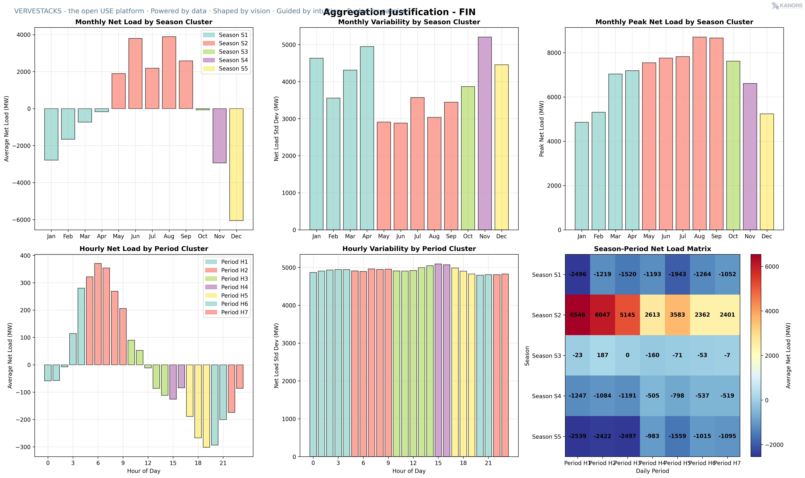
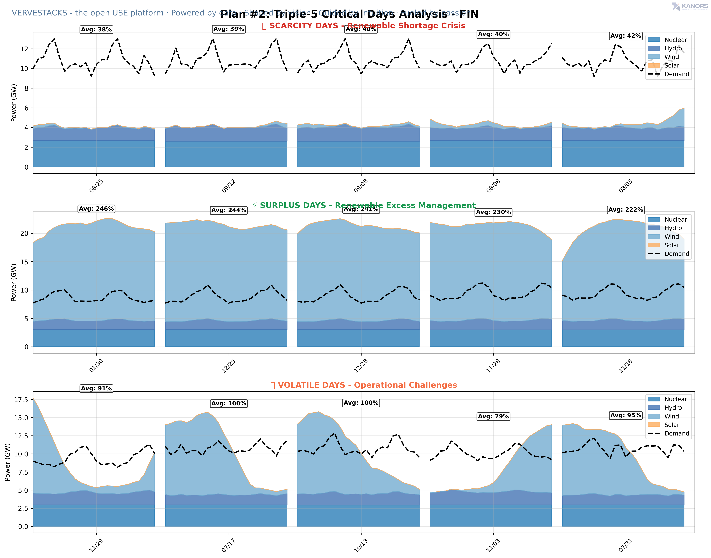
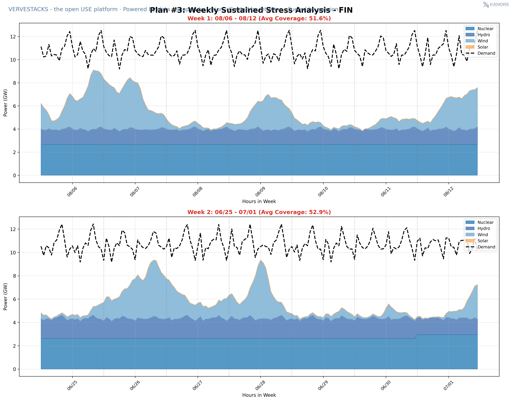
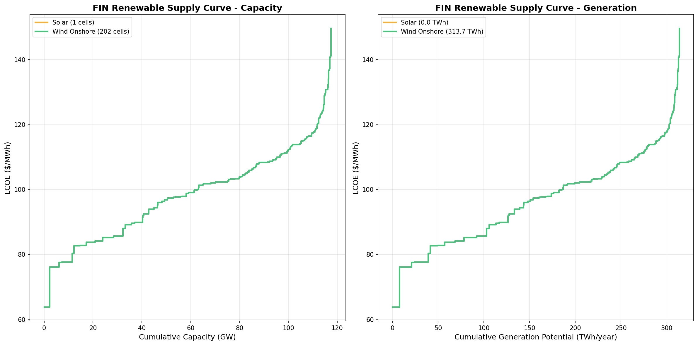

# VerveStacks Model Generation Notes - FIN

**Generated:** 2025-08-25 16:57:27

## Processing Parameters

| Parameter | Value | Description |
|-----------|-------|-------------|
| **Capacity Threshold** | Not specified MW | Minimum plant size for individual tracking |
| **Gas Efficiency Adjustment** | Not specified | Multiplier applied to gas plant efficiencies |
| **Coal Efficiency Adjustment** | Not specified | Multiplier applied to coal plant efficiencies |

## Data, Assumptions & Coverage

### Primary Data Sources

#### Base-Year Power Plant Specifications

- **Global Energy Monitor (GEM)** [🌐](https://globalenergymonitor.org)  
  Open-access database of individual power plants worldwide, including location, capacity, fuel type, commissioning year, and technical specifications.
- **International Renewable Energy Agency (IRENA)** [🌐](https://www.irena.org/Statistics)  
  Global renewable energy capacity and generation statistics (2000–2022), disaggregated by country and technology. Used to calibrate solar, wind and hydro generation.
- **EMBER Climate** [🌐](https://ember-climate.org/data/)  
  Global dataset tracking electricity generation, installed capacity, and emissions intensity (2000–2022), often used to benchmark policy impacts and system transitions. Used to calibrate thermal generation.
- **United Nations Statistics Division (UNSD)** [🌐](https://unstats.un.org/unsd/energy/)  
  Official national energy statistics, including fuel inputs, electricity generation, and sectoral breakdowns — used to validate historical power plant operations.

#### Power Sector Policies and Pathways

- **Network for Greening the Financial System (NGFS)** [🌐](https://www.ngfs.net)  
  Scenario-based projections of electricity demand, CO₂ emissions trajectories, and fuel prices — used to model alternative climate policy futures.
- **EMBER Climate** [🌐](https://ember-climate.org)  
  Renewable energy targets.

#### New Technologies

- **International Energy Agency – World Energy Outlook (IEA WEO)** [🌐](https://www.iea.org/reports/world-energy-outlook-2023)  
  Global assumptions for power generation technologies: capital costs, O&M, efficiency, and learning rates — aligned with IEA scenarios.
- **U.S. National Renewable Energy Laboratory – Annual Technology Baseline (NREL ATB)** [🌐](https://atb.nrel.gov/)  
  Cost and performance trajectories for renewable and low-carbon power technologies. U.S.-centric, but widely used for international modeling.

#### Technology Assumptions

- **U.S. Environmental Protection Agency (EPA)** [🌐](https://www.epa.gov)  
  Technical parameters for retrofitting fossil plants with carbon capture and storage (CCS), including energy penalties and incremental costs.
- **Integrated Planning Model (IPM)** [🌐](https://www.epa.gov/power-sector-modeling/overview-ipm-platform)  
  U.S.-based modeling platform used to estimate life extension costs, variable O&M, and decommissioning behavior of thermal power plants.

### Data Processing Notes
- **Individual Plant Coverage**: TBD of total capacity from plant-level GEM data
- **Total Capacity Tracked**: TBD from all sources
- **Plants Above Threshold**: TBD individual plants tracked above N/A MW threshold
- **Total Plants Processed**: TBD plants in database
- **Technology Mapping**: Automated mapping using VerveStacks technology classifications

### Missing Capacity Added From:
- **No missing capacity added** - All capacity covered by plant-level data

## Model Structure

### Files Included
- **Source Data**: `source_data/VerveStacks_FIN.xlsx` - the full dataset in a model-agnostic format, ready for TIMES/VEDA execution
    # Includes hourly demand and solar/wind resource profiles
- **VEDA Model Files**: Complete model ready for Veda-TIMES execution
- **Scenario Files**: NGFS climate scenarios and policy assumptions

### Key Methodology Points
- Plant-level data prioritized where available (capacity > N/A MW)
- N/A plants tracked individually above threshold
- Efficiency adjustments applied for calibration to national statistics
- Missing capacity filled using technology-specific statistical estimates
- Regional cost multipliers applied based on country economic indicators

## Temporal Modeling & Timeslice Analysis

### Advanced Stress Period Identification

This model employs sophisticated **statistical scenario generation** to identify critical periods in high-renewable energy systems:

#### 🔥 **Scarcity Periods** - Renewable Shortage Crisis
- Days with lowest renewable energy coverage relative to demand
- Critical for capacity planning and storage requirements
- Identifies when conventional backup power is most needed

#### ⚡ **Surplus Periods** - Renewable Excess Management  
- Days with highest renewable generation exceeding demand
- Essential for curtailment analysis and export/storage strategies
- Shows opportunities for demand shifting and industrial electrification

#### 🌪️ **Volatile Periods** - Operational Challenges
- Days with highest generation variability and unpredictability
- Important for grid stability and flexible resource planning
- Captures rapid ramping requirements for dispatchable assets

### Renewable Resource Selection

**Balanced Solar/Wind Portfolio Optimization:**
- Quality-weighted selection based on resource potential and economics
- Grid cell-level analysis using 50x50km resolution REZoning data
- Cost-effectiveness scoring (TWh generation per $/MWh LCOE)
- Technology mix targets derived from historical deployment patterns

**Supply Curve Analysis:**
- Complete renewable resource landscape visualization
- Stepped-line supply curves showing cumulative potential vs. cost
- Integration of wind onshore resource assessments
- Economic competitiveness ranking for investment prioritization

### Coverage Metrics & Energy Balance

**Clean Generation Coverage:**
- Hourly coverage calculation: (Clean Generation + Nuclear) / Demand × 100%
- Range analysis from minimum to maximum coverage throughout the year
- Net load calculations showing residual demand after clean generation
- Stress period selection based on coverage distribution statistics

### Timeslice Structure Generation

**Multi-Scale Temporal Resolution:**
- **Base Aggregation**: 6 seasons × 8 daily periods = 48 base timeslices
- **Critical Period Enhancement**: Additional segments for identified stress periods
- **Statistical Methods**: Triple-1, Triple-5, and Weekly Stress approaches
- **VEDA Integration**: Complete tsdesign.csv with TIMES-compatible mappings

## Timeslice Analysis Visualizations

The following charts provide insights into the temporal characteristics of this energy system:

### Critical Period Analysis Results

**Analysis Status:** Timeslice analysis completed for FIN

#### 🔥 **Detailed Stress Analysis Results:**

**🎯 Triple-1 Critical Days (Most Important 3 Days):**
- 🔴 Scarcity: 08-25 (S01)
- 🔴 Scarcity: 01-30 (S01)
- 🟡 Volatile: 11-29 (V01)

**🎯 Triple-5 Extended Analysis (15 Critical Days):**
*Scarcity Days (Low Coverage):*
  - 08-25 (S01)
  - 09-12 (S02)
  - 09-08 (S03)
  - 08-08 (S04)
  - 08-03 (S05)
*Volatile Days (High Variability):*
  - 11-29 (V01)
  - 07-17 (V02)
  - 10-13 (V03)
  - 11-03 (V04)
  - 07-31 (V05)

**🌨️ Weekly Sustained Stress Analysis:**
- Week W01: 08-06 to 08-12 (7 days)
- Week W02: 06-25 to 07-01 (7 days)

#### 📊 **Generated Analysis Files:**
- `segment_summary_FIN.csv` - Statistical summary of all identified critical periods
- `timeslices_FIN_triple_1.csv` - Triple-1 critical periods (3 days: 1 scarcity + 1 surplus + 1 volatile)
- `timeslices_FIN_triple_5.csv` - Triple-5 critical periods (15 days: 5 scarcity + 5 surplus + 5 volatile)
- `timeslices_FIN_weekly_stress.csv` - Weekly stress periods (2 worst weeks for sustained stress)
- `tsdesign_FIN.csv` - Complete VEDA timeslice structure with temporal mappings

**Stress Period Methodology:**
- **Scarcity Periods**: Days with lowest renewable coverage (highest need for backup power)
- **Surplus Periods**: Days with highest renewable coverage (maximum curtailment potential)  
- **Volatile Periods**: Days with highest generation variability (grid stability challenges)
- **Weekly Stress**: Sustained periods of low renewable coverage (energy security focus)

**Coverage Analysis**: Clean generation (renewables + nuclear) as percentage of hourly demand
- Enables identification of critical periods for capacity planning
- Supports renewable integration and storage requirement analysis
- Provides input for grid flexibility and backup power assessment

### 📊 Generated Analysis Charts

*Interactive visualizations from the timeslice analysis process. Click any chart to view full resolution.*

#### **Timeslice Aggregation Justification** - Statistical analysis supporting the selected temporal resolution structure

*Click image to view full size*

#### **Critical Days Analysis (Triple-5)** - Detailed view of 15 critical days: 5 scarcity + 5 surplus + 5 volatile periods

*Click image to view full size*

#### **Weekly Stress Analysis** - Sustained stress periods showing 2 worst weeks for renewable coverage

*Click image to view full size*

#### **Renewable Supply Curves** - Cost-ordered renewable resource potential showing solar and wind capacity vs. LCOE

*Click image to view full size*

## Quality Assurance
- Cross-validation between IRENA, EMBER, and UNSD statistics
- Capacity-generation consistency checks
- Technology classification verification
- Historical data reconciliation for base year (2022)
- Renewable resource potential validated against REZoning database
- Temporal analysis verified through statistical scenario methods

## Usage Notes
- This model is generated automatically using VerveStacks methodology
- Timeslice structure is optimized for high-renewable energy system analysis
- For questions about specific data sources or methodology, refer to METHODOLOGY_DOCUMENTATION.md
- Model parameters can be adjusted manually in the model files
- Charts and analysis files are located in `2_ts_design/outputs/{input_iso}/`

---
*Generated by VerveStacks Energy Model Processor with Advanced Timeslice Analysis*
*For more information: coming soon*
