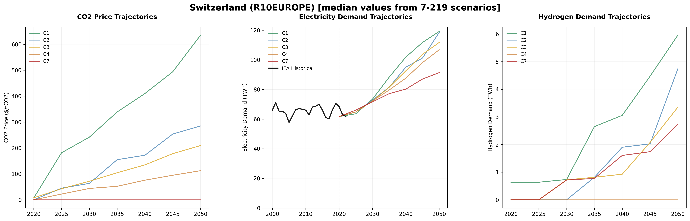

# VerveStacks Model Generation Notes - CHE
**Generated:** 2025-09-06 20:18:36

## Processing Parameters

### Individual Plant Tracking
| **Fuel Type** | **Threshold** | **Plants Above Threshold** |
|---------------|---------------|---------------------------|
| 🌱 **Bioenergy** | 50.0 MW | 1/1 plants |
| 🔥 **Gas** | 10.0 MW | 11/11 plants |
| 💧 **Hydro** | 10.0 MW | 81/81 plants |
| ⚛️ **Nuclear** | 0.0 MW | 4/4 plants |
| 🛢️ **Oil** | 10.0 MW | 10/10 plants |
| ☀️ **Solar** | 200.0 MW | 1/10 plants |
| 💨 **Windon** | 200.0 MW | 0/5 plants |

### 🔄 CCS Retrofit Potential
| **Fuel Type** | **Retrofit Host Capacity** | **Retrofit Potential Capacity**
|---------------|----------------------------|-------------------------------|
| ⚫ **Coal** | 0.0 GW | 0.0 GW after capacity penalty |
| 🔥 **Gas** | 0.5 GW | 0.4 GW after capacity penalty |

## Data, Assumptions & Coverage

### Primary Data Sources

#### Base-Year Power Plant Specifications
- **Global Energy Monitor (GEM)** [🌐](https://globalenergymonitor.org)  
  Open-access database of individual power plants worldwide, including location, capacity, fuel type, commissioning year, and technical specifications.
- **International Renewable Energy Agency (IRENA)** [🌐](https://www.irena.org/Statistics)  
  Global renewable energy capacity and generation statistics (2000–2022), disaggregated by country and technology.
- **EMBER Climate** [🌐](https://ember-climate.org/data/)  
  Global dataset tracking electricity generation, installed capacity, and emissions intensity (2000–2022).

### Data Processing Notes
- **Individual Plant Coverage**: 88.0%% of total capacity from plant-level GEM data
- **Total Capacity Tracked**: 25.5 GW GW from all sources
- **Plants Above Threshold**: 55 individual plants tracked
- **Total Plants Processed**: 122 plants in database
- **Missing Capacity Added**: - **EMBER data**:
  - **bioenergy**: 0.23 GW
  - **gas**: 0.13 GW
- **IRENA data**:
  - **hydro**: 3.18 GW
  - **solar**: 4.43 GW

## Model Structure

### Files Included
- **Source Data**: `source_data/VerveStacks_CHE.xlsx` - the full dataset in a model-agnostic format
- **VEDA Model Files**: Complete model ready for Veda-TIMES execution
- **Scenario Files**: NGFS climate scenarios and policy assumptions

## AR6 Climate Scenarios - R10PAC_OECD

This model incorporates climate scenario drivers from the IPCC AR6 database for the **R10PAC_OECD** region, 
derived from 350 vetted scenario-model combinations spanning 5 climate categories 
from ambitious 1.5°C pathways (C1) to limited mitigation trajectories (C7). The scenarios cover 
7 years from 2020 to 2050, providing comprehensive 
pathways for energy system transformation under different climate policy futures.

### Climate Scenario Trajectories

  
  
<em>Climate scenario trajectories showing CO2 prices, electricity growth, and hydrogen deployment across different climate ambitions</em>

**Key Insights:**
- **5 Climate Categories**: From 1.5°C pathways to baseline scenarios
- **350 Scenario-Model Combinations**: Comprehensive coverage of transformation pathways  
- **Regional Context**: R10PAC_OECD region-specific climate policy patterns
- **Temporal Coverage**: 2020-2050 transformation trajectories

### Scenario-Model Divergence Analysis

**Model Agreement**: Analysis across 350 scenario-model combinations reveals:
- **High Convergence**: CO2 pricing trajectories (CV: inf%) and electricity growth (CV: 16.0%)
- **Moderate Uncertainty**: Transport electrification rates (CV: 62.8%) 
- **High Divergence**: Hydrogen deployment pathways (CV: inf%)

**Regional Characteristics**: The R10PAC_OECD region shows moderate convergence compared to global 
averages, with region-specific climate policy patterns reflecting economic and policy context.

## Temporal Modeling & Timeslice Analysis

### Advanced Stress Period Identification

This model employs sophisticated **statistical scenario generation** to identify critical periods in high-renewable energy systems:

#### 🔥 **Scarcity Periods** - Renewable Shortage Crisis
- Days with lowest renewable energy coverage relative to demand
- Critical for capacity planning and storage requirements
- Identifies when conventional backup power is most needed

#### ⚡ **Surplus Periods** - Renewable Excess Management  
- Days with highest renewable generation exceeding demand
- Essential for curtailment analysis and export/storage strategies
- Shows opportunities for demand shifting and industrial electrification

#### 🌪️ **Volatile Periods** - Operational Challenges
- Days with highest generation variability and unpredictability
- Important for grid stability and flexible resource planning
- Captures rapid ramping requirements for dispatchable assets

### Timeslice Structure Generation
**Multi-Scale Temporal Resolution:**
- **Base Aggregation**: 6 seasons × 8 daily periods = 48 base timeslices
- **Critical Period Enhancement**: Additional segments for identified stress periods

## Quality Assurance

- Cross-validation between IRENA, EMBER, and UNSD statistics
- Capacity-generation consistency checks
- Technology classification verification
- Historical data reconciliation for base year (2022)
- Renewable resource potential validated against REZoning database
- Temporal analysis verified through statistical scenario methods

## Usage Notes

- This model is generated automatically using VerveStacks methodology
- Timeslice structure is optimized for high-renewable energy system analysis
- For questions about specific data sources or methodology, refer to online documentation
- Model parameters can be adjusted manually in the model files
- Charts and analysis files are located in `2_ts_design/outputs/CHE/`

---
*Generated by VerveStacks Energy Model Processor*
*For more information: [VerveStacks Documentation](https://github.com/your-org/vervestacks)*
