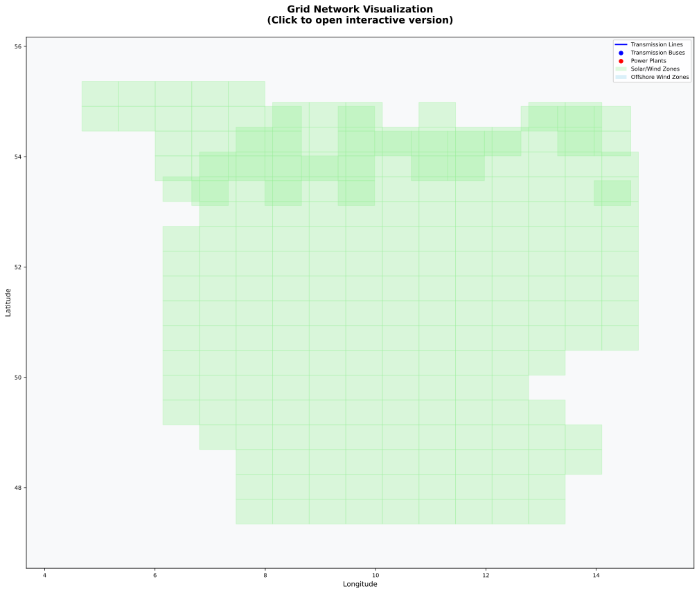

# VerveStacks Model Generation Notes - DEU
**Generated:** 2025-09-06 14:50:37

## Processing Parameters

### Individual Plant Tracking
| **Fuel Type** | **Threshold** | **Plants Above Threshold** |
|---------------|---------------|---------------------------|
| 🌱 **Bioenergy** | 50.0 MW | 32/43 plants |
| ⚫ **Coal** | 110.0 MW | 85/108 plants |
| 🔥 **Gas** | 110.0 MW | 100/261 plants |
| 🌋 **Geothermal** | 10.0 MW | 0/5 plants |
| 💧 **Hydro** | 10.0 MW | 58/58 plants |
| 🛢️ **Oil** | 110.0 MW | 100/261 plants |
| ☀️ **Solar** | 200.0 MW | 173/2023 plants |
| 🌊 **Windoff** | 200.0 MW | 29/40 plants |
| 💨 **Windon** | 200.0 MW | 34/1487 plants |

### 🔄 CCS Retrofit Potential
| **Fuel Type** | **Retrofit Host Capacity** | **Retrofit Potential Capacity**
|---------------|----------------------------|-------------------------------|
| ⚫ **Coal** | 40.4 GW | 29.4 GW after capacity penalty |
| 🔥 **Gas** | 37.5 GW | 31.7 GW after capacity penalty |

## Data, Assumptions & Coverage

### Primary Data Sources

#### Base-Year Power Plant Specifications
- **Global Energy Monitor (GEM)** [🌐](https://globalenergymonitor.org)  
  Open-access database of individual power plants worldwide, including location, capacity, fuel type, commissioning year, and technical specifications.
- **International Renewable Energy Agency (IRENA)** [🌐](https://www.irena.org/Statistics)  
  Global renewable energy capacity and generation statistics (2000–2022), disaggregated by country and technology.
- **EMBER Climate** [🌐](https://ember-climate.org/data/)  
  Global dataset tracking electricity generation, installed capacity, and emissions intensity (2000–2022).

### Data Processing Notes
- **Individual Plant Coverage**: 70.2%% of total capacity from plant-level GEM data
- **Total Capacity Tracked**: 281.3 GW GW from all sources
- **Plants Above Threshold**: 736 individual plants tracked
- **Total Plants Processed**: 4286 plants in database
- **Missing Capacity Added**: - **IRENA data**:
  - **solar**: 36.12 GW
  - **windon**: 8.17 GW
  - **hydro**: 4.02 GW
- **EMBER data**:
  - **bioenergy**: 8.78 GW
  - **coal**: 7.64 GW

## Model Structure

### Files Included
- **Source Data**: `source_data/VerveStacks_DEU.xlsx` - the full dataset in a model-agnostic format
- **VEDA Model Files**: Complete model ready for Veda-TIMES execution
- **Scenario Files**: NGFS climate scenarios and policy assumptions

## Temporal Modeling & Timeslice Analysis

### Advanced Stress Period Identification

This model employs sophisticated **statistical scenario generation** to identify critical periods in high-renewable energy systems:

#### 🔥 **Scarcity Periods** - Renewable Shortage Crisis
- Days with lowest renewable energy coverage relative to demand
- Critical for capacity planning and storage requirements
- Identifies when conventional backup power is most needed

#### ⚡ **Surplus Periods** - Renewable Excess Management  
- Days with highest renewable generation exceeding demand
- Essential for curtailment analysis and export/storage strategies
- Shows opportunities for demand shifting and industrial electrification

#### 🌪️ **Volatile Periods** - Operational Challenges
- Days with highest generation variability and unpredictability
- Important for grid stability and flexible resource planning
- Captures rapid ramping requirements for dispatchable assets

### Timeslice Structure Generation
**Multi-Scale Temporal Resolution:**
- **Base Aggregation**: 6 seasons × 8 daily periods = 48 base timeslices
- **Critical Period Enhancement**: Additional segments for identified stress periods

## Grid Network Visualization

### 🗺️ **Grid Network Overview**

This model includes a **comprehensive grid visualization** showing the complete transmission infrastructure and renewable energy integration:

  
  
<em>🗺️ Grid network showing transmission infrastructure, power plants, and renewable energy zones</em>

**What you can explore:**
- **Transmission Network**: High-voltage lines and substations from real grid data
- **Power Plant Locations**: Actual generating facilities mapped to grid buses
- **Renewable Energy Zones**: 50×50km grid cells with solar/wind potential
- **Load Centers**: Industrial demand distribution across the network
- **Grid Constraints**: Bottlenecks and transmission limitations

### Grid Topology Statistics

#### 📊 **Transmission Infrastructure**

| **Metric** | **Value** | **Description** |
|------------|-----------|-----------------|
| **Total Buses** | 795 | Transmission substations and connection points |
| **Transmission Lines** | 1029 | High-voltage transmission corridors |
| **Voltage Levels** | 220, 225, 320, 380, 400, 450, 525 | Multi-level transmission system (220kV, 380kV, etc.) |
| **Grid Coverage** | 496701 km² | Geographic area covered by transmission network |
| **Average Line Length** | 24826.4 km | Mean distance between connected buses |

#### ⚡ **Power Plant Integration**

| **Integration Type** | **Count** | **Total Capacity** | **Description** |
|---------------------|-----------|-------------------|-----------------|
| **Plants Mapped to Buses** | 9230 | 9230 GW | GEM power plants assigned to grid locations |
| **Renewable Plants** | 0 | 0 GW | Solar, wind, hydro plants on the grid |
| **Conventional Plants** | 0 | 0 GW | Coal, gas, nuclear plants on the grid |
| **Clustering Efficiency** | 0.0% | - | Bus reduction achieved through DBSCAN clustering |

### Spatial Resolution & Renewable Zones

#### 🗺️ **High-Resolution Grid Modeling**

This model employs **50×50km spatial resolution** for detailed renewable energy analysis:

| **Spatial Metric** | **Value** | **Technical Detail** |
|-------------------|-----------|---------------------|
| **Grid Cells** | 933 | 50×50km renewable energy zones |
| **Solar/Wind Onshore Zones** | 841 | Grid cells with solar and onshore wind potential |
| **Wind Offshore Zones** | 91 | Grid cells with offshore wind potential |
| **Zone-Bus Mappings** | 933 | REZoning zones assigned to transmission buses |
| **Spatial Coverage** | 2102500 km² | Total area covered by renewable zones |

#### 🔌 **Spatial Commodity System**

Each grid cell generates location-specific electricity commodities:
- **Solar/Wind Onshore**: `elc_spv-DEU_001` to `elc_spv-DEU_841` (same zones for both technologies)
- **Wind Offshore**: `elc_wof-DEU_001` to `elc_wof-DEU_91`

This enables **grid-aware optimization** where renewable generation is constrained by:
- Transmission capacity between zones
- Grid stability requirements
- Spatial resource quality variations
- Inter-zone electricity trade opportunities

### Load Distribution Analysis

#### 🏭 **Industrial Demand Mapping**

Industrial electricity demand is spatially distributed across the transmission network using **Voronoi tessellation**:

| **Load Distribution Method** | **Buses with Load** | **Total Industrial Load** | **Methodology** |
|------------------------------|---------------------|---------------------------|-----------------|
| **Voronoi Tessellation** | 188 | 1.0 GW | Geometric proximity-based allocation |

#### 📈 **Load Concentration Analysis**

- **Highest Load Bus**: way/30303506-380 (0.09 GW)
- **Load Distribution CV**: 0% (coefficient of variation)
- **Load Balancing**: Balanced distribution across transmission buses

This spatial load distribution enables **realistic grid modeling** where:
- Industrial demand varies by location
- Transmission constraints affect supply-demand balancing
- Grid bottlenecks impact renewable integration
- Regional electricity trade opportunities are identified

### Technical Implementation

#### 🔬 **Grid Processing Methodology**

**1. Network Extraction & Clustering**
- **Source**: OpenStreetMap transmission data via PyPSA-Eur
- **Clustering**: DBSCAN algorithm reduces bus count by 0.0%
- **Topology Preservation**: Critical transmission lines maintained during clustering
- **Voltage Hierarchy**: Multi-level transmission system (220kV, 380kV, 500kV)

**2. Renewable Zone Integration**
- **REZoning Database**: 50×50km grid cells with LCOE and capacity factor data
- **Spatial Mapping**: Zones assigned to nearest transmission buses
- **Resource Quality**: Capacity factors vary by location and technology
- **Grid Constraints**: Transmission capacity limits renewable integration

**3. Power Plant Assignment**
- **GEM Database**: Global Energy Monitor power plant locations
- **Spatial Proximity**: Plants assigned to nearest transmission buses
- **Capacity Aggregation**: Multiple plants at same bus aggregated
- **Technology Classification**: Fuel type and generation technology preserved

**4. Load Distribution Algorithm**
- **Industrial Database**: Hotmaps industrial electricity consumption
- **Voronoi Tessellation**: Geometric proximity-based allocation to nearest transmission buses
- **Grid Integration**: Load assigned to transmission buses, not individual consumers

#### 🎯 **Model Capabilities**

This grid modeling enables:
- **Transmission Constraint Analysis**: Identify grid bottlenecks and expansion needs
- **Renewable Integration Studies**: Optimize renewable deployment considering grid limits
- **Inter-Regional Trade**: Model electricity exchange between grid zones
- **Grid Stability Assessment**: Analyze system stability with high renewable penetration
- **Investment Planning**: Identify optimal transmission and generation investments

## Quality Assurance

- Cross-validation between IRENA, EMBER, and UNSD statistics
- Capacity-generation consistency checks
- Technology classification verification
- Historical data reconciliation for base year (2022)
- Renewable resource potential validated against REZoning database
- Temporal analysis verified through statistical scenario methods

## Usage Notes

- This model is generated automatically using VerveStacks methodology
- Timeslice structure is optimized for high-renewable energy system analysis
- For questions about specific data sources or methodology, refer to online documentation
- Model parameters can be adjusted manually in the model files
- Charts and analysis files are located in `2_ts_design/outputs/DEU/`

---
*Generated by VerveStacks Energy Model Processor*
*For more information: [VerveStacks Documentation](https://github.com/your-org/vervestacks)*
