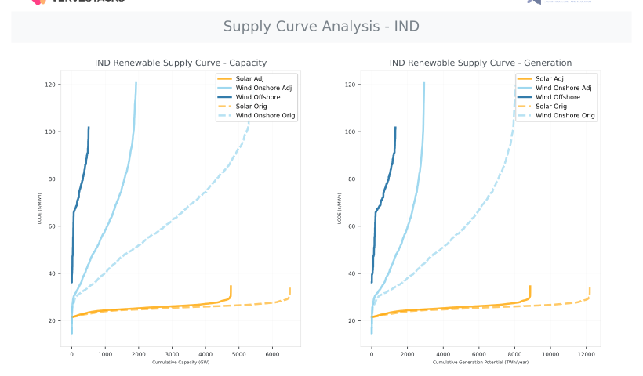
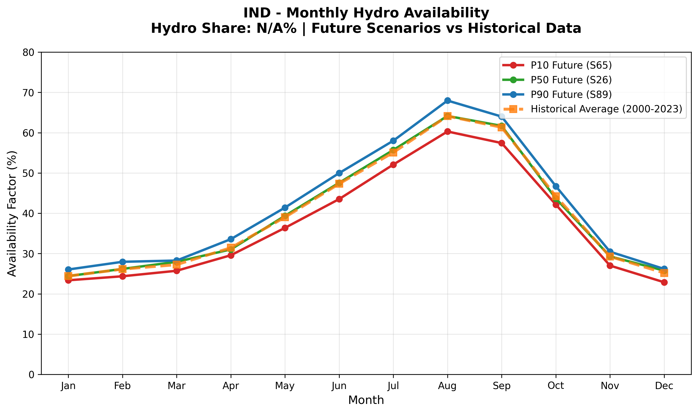
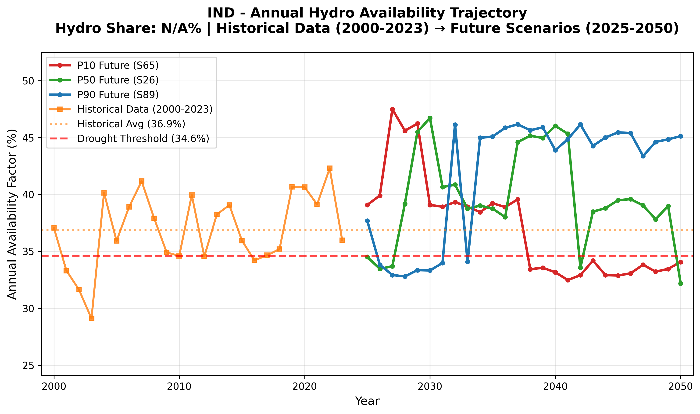
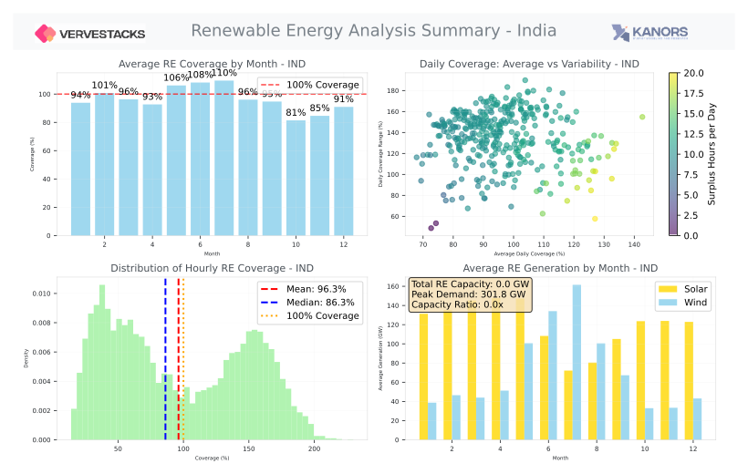
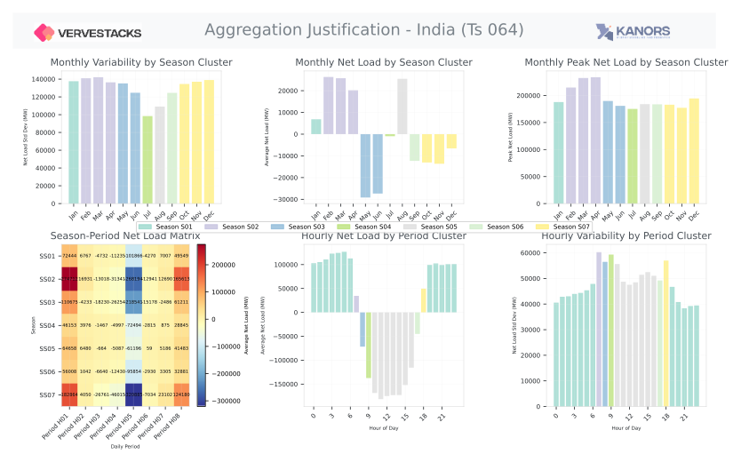
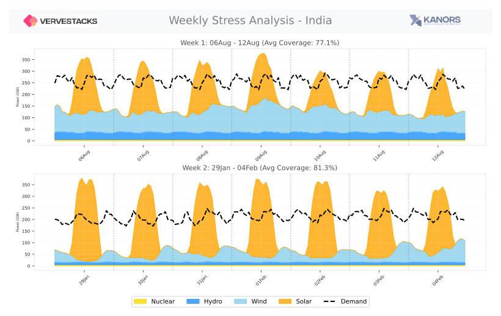
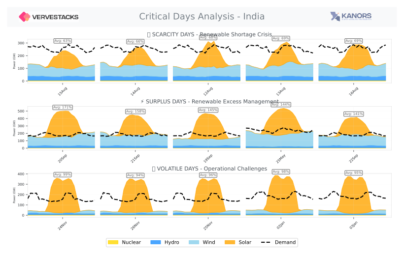

# VerveStacks Model Generation Notes - IND
**Generated:** 2025-09-13 09:49:01

## Model Calibration 2022

| **Total Capacity** | **Total Generation** | **CO2 Emissions** | **Calibration to EMBER** |
|--------------|---------------|------------|--------------------------|
| 440 GW | 1829 TWh | 1289 Mt | 100% |

**Note:** 2022 fossil and bio capacity is calibrated to EMBER and renewable capacities to IRENA. UNSD has incomplete data for fuel consumption, so the calibration is demonstrated against the total CO2 emission reported by EMBER. This shows that the efficiency assumptions are good.

## Processing Parameters

### Individual Plant Tracking
| **Fuel Type** | **Threshold** | **Plants Above Threshold** | **Active Capacity** | **Mothballed Capacity** | **Wtd Avg Efficiency** |
|---------------|---------------|----------------------------|--------------------|--------------------------|-----------------|
| 🌱 **Bioenergy** | 50 MW | 7/13 plants | 10.4 GW | — | 34% |
| ⚫ **Coal** | 500 MW | 329/350 plants | 272 GW | 0.581 GW | 36% |
| 🔥 **Gas** | 500 MW | 24/49 plants | 32.6 GW | — | 52% |
| 💧 **Hydro** | 110 MW | 146/194 plants | 66 GW | 2.97 GW | 100% |
| ⚛️ **Nuclear** | — | 31/31 plants | 13.4 GW | 0.64 GW | 100% |
| 🛢️ **Oil** | 500 MW | 0/5 plants | 0.656 GW | — | 39% |
| ☀️ **Solar** | 200 MW | 176/180 plants | 107 GW | — | 100% |
| 💨 **Windon** | 200 MW | 64/73 plants | 52 GW | — | 33% |

### 🔄 CCS Retrofit Potential
| **Fuel Type** | **Retrofit Host Capacity** | **Retrofit Potential Capacity**
|---------------|----------------------------|-------------------------------|
| ⚫ **Coal** | 273 GW | 191 GW after capacity penalty |
| 🔥 **Gas** | 32.6 GW | 27.6 GW after capacity penalty |

## Data, Assumptions & Coverage

### Primary Data Sources

#### Base-Year Power Plant Specifications
- **Global Energy Monitor (GEM)** [🌐](https://globalenergymonitor.org)  
  Open-access database of individual power plants worldwide, including location, capacity, fuel type, commissioning year, and technical specifications.
- **International Renewable Energy Agency (IRENA)** [🌐](https://www.irena.org/Statistics)  
  Global renewable energy capacity and generation statistics (2000–2022), disaggregated by country and technology.
- **EMBER Climate** [🌐](https://ember-climate.org/data/)  
  Global dataset tracking electricity generation, installed capacity, and emissions intensity (2000–2022).

#### Enhanced Renewable Energy Characterization
- **GEM-REZoning-Atlite Integration** [`re_units_cf_grid_cell_mapping.csv`]  
  Enhanced renewable energy units with capacity factors from Atlite weather data and precise grid cell locations from REZoning database. This integration provides spatially-resolved capacity factors for existing renewable plants, enabling accurate performance modeling and grid cell assignment for spatial optimization.
- **Capacity Factor Enhancement**: Individual renewable plants receive location-specific capacity factors derived from 2013 hourly weather patterns
- **Spatial Grid Assignment**: Plants mapped to 50x50km REZoning grid cells for consistent spatial modeling

### Data Processing Notes
- **Individual Plant Coverage**: 99%% of total capacity from plant-level GEM data
- **Total Capacity Tracked**: 559 GW GW from all sources
- **Plants Above Threshold**: 821 individual plants tracked
- **Total Plants Processed**: 895 plants in database
- **Missing Capacity Added**: - **IRENA data**:
  - **hydro**: 5.06 GW
  - **solar**: 1.1 GW
  - **windon**: 8.92 GW
- **EMBER data**:
  - **gas**: 5.03 GW
  - **bioenergy**: 9.73 GW

## Model Structure

### Files Included
- **Source Data**: `source_data/VerveStacks_IND.xlsx` - the full dataset in a model-agnostic format
- **VEDA Model Files**: Complete model ready for Veda-TIMES execution
- **Scenario Files**: NGFS climate scenarios and policy assumptions

## Renewable Energy Characterization

VerveStacks provides comprehensive renewable energy potential analysis at unprecedented spatial resolution, 
combining global resource assessments with realistic deployment constraints to deliver actionable insights 
for energy system planning.

### **Data Foundation: REZoning Integration**

Our renewable energy characterization builds on the REZoning database, providing detailed potential 
assessments at 50×50 km grid resolution across 190+ countries. This high-resolution spatial data 
captures the nuanced variations in renewable energy resources that are critical for accurate energy 
system modeling.

**Data Sources:**
- **Solar Potential**: REZoning solar resource data with capacity factors and LCOE estimates
- **Wind Onshore**: REZoning onshore wind potential with economic viability assessments  
- **Wind Offshore**: REZoning offshore wind resources with marine-specific constraints
- **Hourly Profiles**: Atlite-derived capacity factor time series for each grid cell

### **Land Use Conflict Resolution: Conservative Overlap Management**

A critical challenge in renewable energy assessment is avoiding double-counting of land areas suitable 
for both solar and wind development. VerveStacks implements a **conservative overlap resolution algorithm** 
that ensures realistic deployment scenarios:

**Most Pessimistic Assumption:**
- When grid cells overlap between solar and wind potential, we apply **LCOE-based allocation**
- The technology with **higher LCOE (less competitive)** receives a **reduced share** of the overlapping area
- This conservative approach ensures our estimates represent **deployable potential** rather than theoretical maximums
- **No double-counting**: Each grid cell contributes to less than the REZoning resource limits in cells with overlap

This methodology reflects real-world deployment patterns where developers choose the most economically 
viable technology for each location, ensuring our supply curves represent **realistic, achievable 
renewable energy potential**.

### **Supply Curve Visualization**

The resulting supply curves reveal the economic characteristics of renewable energy deployment, 
showing how costs evolve as more capacity is developed:

**Chart Features:**
- **LCOE vs Cumulative Capacity**: Economic viability as deployment scales
- **LCOE vs Cumulative Generation**: Resource potential in energy terms
- **Technology Comparison**: Solar, Wind Onshore, and Wind Offshore potential
- **Original vs Landuse-Adjusted**: Impact of conservative overlap management

This analysis provides the foundation for understanding renewable energy economics and informs 
capacity expansion decisions in the VEDA/TIMES energy system models.

## 💧 Hydro Availability Scenarios

### Planning for Hydro Uncertainty

Hydroelectric generation is inherently variable due to seasonal patterns, year-to-year climate variations, and long-term climate change. Traditional energy models often assume constant hydro availability based on historical averages, which can lead to significant underestimation of backup capacity needs and inadequate drought preparedness.

**VerveStacks addresses this critical gap** by generating probabilistic hydro availability scenarios that capture:
- **Natural variability**: Seasonal wet/dry cycles and multi-year persistence
- **Climate change impacts**: Declining mean availability and increasing extremes  
- **Extreme events**: Drought sequences that stress energy systems
- **Country-specific patterns**: Drought thresholds based on historical operational experience

### **Methodology Overview**

Our approach combines **24 years of historical data** (2000-2023) from EMBER Climate with advanced scenario generation to create realistic future pathways:

1. **Historical Analysis**: Extract seasonal patterns, drought frequencies, and country-specific thresholds
2. **Regime Classification**: Model persistence of wet, normal, and dry conditions  
3. **Climate Adjustment**: Apply declining trends and increasing variability
4. **Scenario Generation**: Create 100+ plausible futures preserving historical characteristics

**Key Innovation**: Drought thresholds are derived from each country's bottom 20% of historical capacity factors, ensuring definitions reflect actual operational stress rather than arbitrary percentages.

### **IND Hydro Profile**

| **Planning Parameter** | **Value** | **Application** |
|----------------------|-----------|-----------------|
| **Hydro Dependency** | N/A% of generation | System vulnerability assessment |
| **P10 (Dry Scenario)** | 37.1% annual average | Security planning, reserve sizing |
| **P50 (Base Scenario)** | 39.7% annual average | Expected case, financial planning |
| **P90 (Wet Scenario)** | 41.9% annual average | Export opportunities, minimum backup |
| **Historical Average** | 36.9% (2000-2023) | Validation benchmark |
| **Drought Threshold** | 34.6% (P20 of historical) | Operational stress indicator |

### **Monthly Availability Patterns**

  
  
<em>Monthly hydro availability showing P10/P50/P90 future scenarios validated against historical patterns</em>

### **Long-term Trajectory Analysis**

  
  
<em>Annual hydro trajectories connecting historical data (2000-2023) to future scenarios (2025-2050)</em>

### **Planning Applications**

**Capacity Planning**: Use P50 for base case sizing, verify adequacy with P10 scenarios  
**Investment Analysis**: P10 scenarios for downside risk, P90 for upside potential  
**System Operations**: P10 for emergency preparedness, P50 for maintenance scheduling  
**Policy Analysis**: Understand drought impacts on energy security and backup requirements

**Key Insight**: The future will not match historical averages. Planning for hydro variability using P10/P50/P90 scenarios is essential for reliable, cost-effective energy systems.

## Temporal Modeling & Timeslice Analysis

### Advanced Stress Period Identification

This model employs sophisticated **statistical scenario generation** to identify critical periods in high-renewable energy systems:

#### 🔥 **Scarcity Periods** - Renewable Shortage Crisis
- Days with lowest renewable energy coverage relative to demand
- Critical for capacity planning and storage requirements
- Identifies when conventional backup power is most needed

#### ⚡ **Surplus Periods** - Renewable Excess Management  
- Days with highest renewable generation exceeding demand
- Essential for curtailment analysis and export/storage strategies
- Shows opportunities for demand shifting and industrial electrification

#### 🌪️ **Volatile Periods** - Operational Challenges
- Days with highest generation variability and unpredictability
- Important for grid stability and flexible resource planning
- Captures rapid ramping requirements for dispatchable assets

### Comprehensive Stress Period Analysis

The following visualizations provide detailed insights into temporal patterns and critical periods:

#### **Renewable Energy Analysis Overview**

#### **Aggregated months and hours (8 X 8 case)**

#### **Weekly Stress Periods (Extended Analysis)**

#### **Triple-5 Critical Periods (Comprehensive Stress Analysis)**

### Timeslice Structure Generation
**Multi-Scale Temporal Resolution:**
- **Base Aggregation**: 6 seasons × 8 daily periods = 48 base timeslices
- **Critical Period Enhancement**: Additional segments for identified stress periods

## AR6 Climate Scenarios - R10INDIA+

This model incorporates climate scenario drivers from the IPCC AR6 database for the **R10INDIA+** region, 
derived from 350 vetted scenario-model combinations spanning 5 climate categories 
from ambitious 1.5°C pathways (C1) to limited mitigation trajectories (C7). The scenarios cover 
7 years from 2020 to 2050, providing comprehensive 
pathways for energy system transformation under different climate policy futures.

### Climate Scenario Trajectories

  
  
<em>Climate scenario trajectories showing CO2 prices, electricity growth, and hydrogen deployment across different climate ambitions</em>

**Key Insights:**
- **5 Climate Categories**: From 1.5°C pathways to baseline scenarios
- **350 Scenario-Model Combinations**: Comprehensive coverage of transformation pathways  
- **Regional Context**: R10INDIA+ region-specific climate policy patterns
- **Temporal Coverage**: 2020-2050 transformation trajectories

### Scenario-Model Divergence Analysis

**Model Agreement**: Analysis across 350 scenario-model combinations reveals:
- **High Convergence**: CO2 pricing trajectories (CV: inf%) and electricity growth (CV: 32.0%)
- **Moderate Uncertainty**: Transport electrification rates (CV: 63.7%) 
- **High Divergence**: Hydrogen deployment pathways (CV: 161.7%)

**Regional Characteristics**: The R10INDIA+ region shows moderate convergence compared to global 
averages, with region-specific climate policy patterns reflecting economic and policy context.

## Quality Assurance

- Cross-validation between IRENA, EMBER, and UNSD statistics
- Capacity-generation consistency checks
- Technology classification verification
- Historical data reconciliation for base year (2022)
- Renewable resource potential validated against REZoning database
- Temporal analysis verified through statistical scenario methods

## Usage Notes

- This model is generated automatically using VerveStacks methodology
- Timeslice structure is optimized for high-renewable energy system analysis
- For questions about specific data sources or methodology, refer to online documentation
- Model parameters can be adjusted manually in the model files
- Charts and analysis files are located in `2_ts_design/outputs/IND/`

---
*Generated by VerveStacks Energy Model Processor*
*For more information: [VerveStacks Documentation](https://github.com/your-org/vervestacks)*
