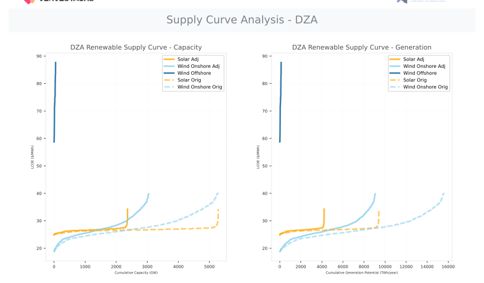
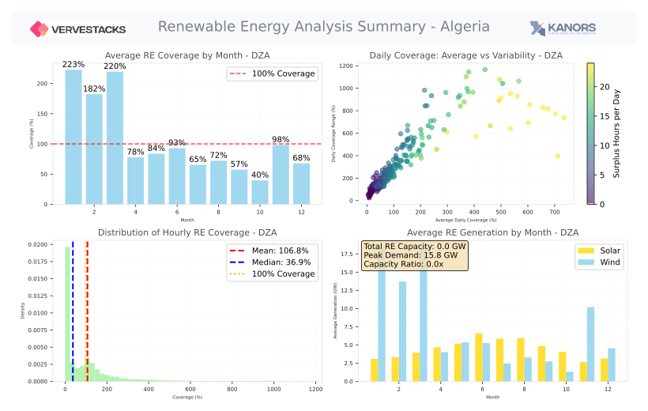
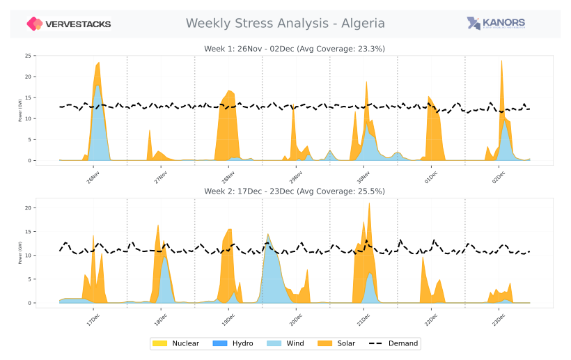
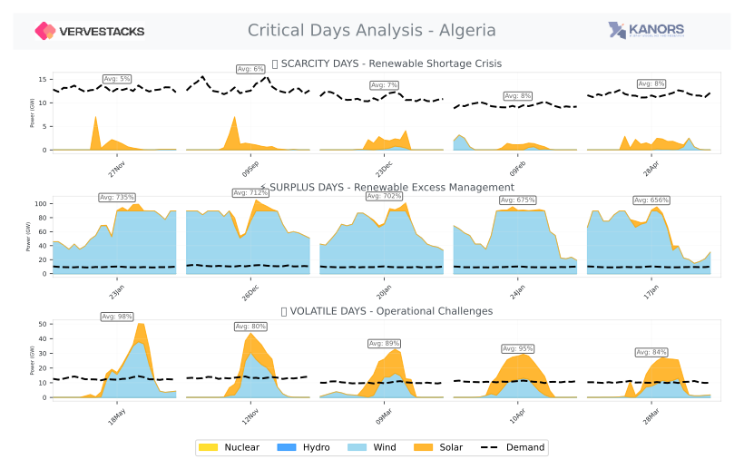
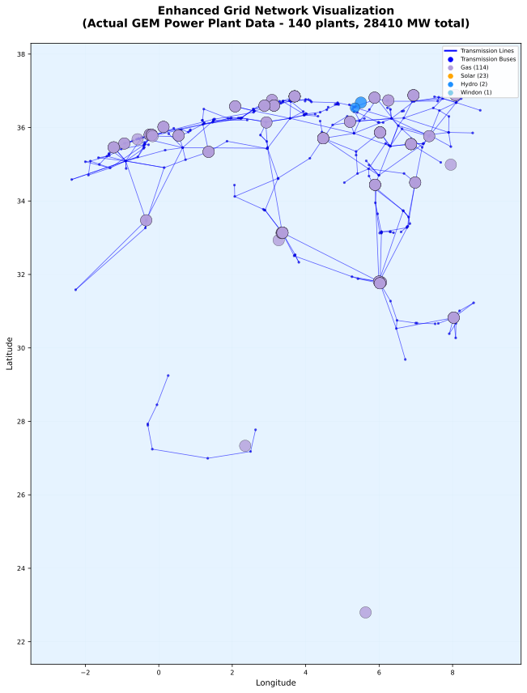
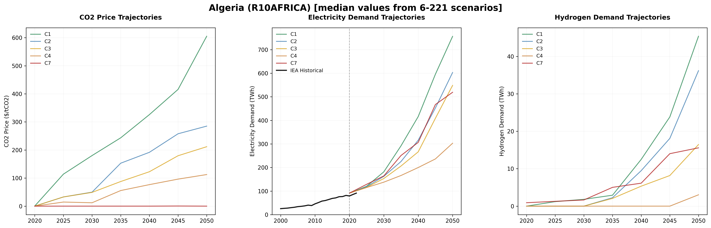

# VerveStacks Model Generation Notes - DZA
**Generated:** 2025-09-19 23:35:18

## Model Calibration 2022

| **Total Capacity** | **Total Generation** | **CO2 Emissions** | **Calibration to EMBER** |
|--------------|---------------|------------|--------------------------|
| 24.2 GW | 88 TWh | 56 Mt | 100% |

**Note:** 2022 fossil and bio capacity is calibrated to EMBER and renewable capacities to IRENA. UNSD has incomplete data for fuel consumption, so the calibration is demonstrated against the total CO2 emission reported by EMBER. This shows that the efficiency assumptions are good.

## Processing Parameters

### Individual Plant Tracking
| **Fuel Type** | **Threshold** | **Plants Above Threshold** | **Active Capacity** | **Wtd Avg Efficiency** |
|---------------|---------------|----------------------------|--------------------|-----------------|
| 🔥 **Gas** | 100 MW | 113/115 plants | 27.7 GW | 35% |
| 💧 **Hydro** | 10 MW | 2/2 plants | 0.172 GW | 100% |
| ☀️ **Solar** | 200 MW | 0/34 plants | 0.576 GW | 100% |
| 💨 **Windon** | 200 MW | 0/1 plants | 0.01 GW | 33% |

### 🔄 CCS Retrofit Potential
| **Fuel Type** | **Retrofit Host Capacity** | **Retrofit Potential Capacity**
|---------------|----------------------------|-------------------------------|
| ⚫ **Coal** | 0 GW | 0 GW after capacity penalty |
| 🔥 **Gas** | 27.7 GW | 23.4 GW after capacity penalty |

## Data, Assumptions & Coverage

### Primary Data Sources

#### Base-Year Power Plant Specifications
- **Global Energy Monitor (GEM)** [🌐](https://globalenergymonitor.org)  
  Open-access database of individual power plants worldwide, including location, capacity, fuel type, commissioning year, and technical specifications.
- **International Renewable Energy Agency (IRENA)** [🌐](https://www.irena.org/Statistics)  
  Global renewable energy capacity and generation statistics (2000–2022), disaggregated by country and technology.
- **EMBER Climate** [🌐](https://ember-climate.org/data/)  
  Global dataset tracking electricity generation, installed capacity, and emissions intensity (2000–2022).

#### Enhanced Renewable Energy Characterization
- **GEM-REZoning-Atlite Integration** [`re_units_cf_grid_cell_mapping.csv`]  
  Enhanced renewable energy units with capacity factors from Atlite weather data and precise grid cell locations from REZoning database. This integration provides spatially-resolved capacity factors for existing renewable plants, enabling accurate performance modeling and grid cell assignment for spatial optimization.
- **Capacity Factor Enhancement**: Individual renewable plants receive location-specific capacity factors derived from 2013 hourly weather patterns
- **Spatial Grid Assignment**: Plants mapped to 50x50km REZoning grid cells for consistent spatial modeling

### Data Processing Notes
- **Individual Plant Coverage**: 97%% of total capacity from plant-level GEM data
- **Total Capacity Tracked**: 28.4 GW GW from all sources
- **Plants Above Threshold**: 114 individual plants tracked
- **Total Plants Processed**: 152 plants in database
- **Missing Capacity Added**: - **No missing capacity added** - All capacity covered by plant-level data

## Model Structure

### Files Included
- **Source Data**: `source_data/VerveStacks_DZA.xlsx` - the full dataset in a model-agnostic format
- **VEDA Model Files**: Complete model ready for Veda-TIMES execution
- **Scenario Files**: NGFS climate scenarios and policy assumptions

## Renewable Energy Characterization

VerveStacks provides comprehensive renewable energy potential analysis at unprecedented spatial resolution, 
combining global resource assessments with realistic deployment constraints to deliver actionable insights 
for energy system planning.

### **Data Foundation: REZoning Integration**

Our renewable energy characterization builds on the REZoning database, providing detailed potential 
assessments at 50×50 km grid resolution across 190+ countries. This high-resolution spatial data 
captures the nuanced variations in renewable energy resources that are critical for accurate energy 
system modeling.

**Data Sources:**
- **Solar Potential**: REZoning solar resource data with capacity factors and LCOE estimates
- **Wind Onshore**: REZoning onshore wind potential with economic viability assessments  
- **Wind Offshore**: REZoning offshore wind resources with marine-specific constraints
- **Hourly Profiles**: Atlite-derived capacity factor time series for each grid cell

### **Land Use Conflict Resolution: Conservative Overlap Management**

A critical challenge in renewable energy assessment is avoiding double-counting of land areas suitable 
for both solar and wind development. VerveStacks implements a **conservative overlap resolution algorithm** 
that ensures realistic deployment scenarios:

**Most Pessimistic Assumption:**
- When grid cells overlap between solar and wind potential, we apply **LCOE-based allocation**
- The technology with **higher LCOE (less competitive)** receives a **reduced share** of the overlapping area
- This conservative approach ensures our estimates represent **deployable potential** rather than theoretical maximums
- **No double-counting**: Each grid cell contributes to less than the REZoning resource limits in cells with overlap

This methodology reflects real-world deployment patterns where developers choose the most economically 
viable technology for each location, ensuring our supply curves represent **realistic, achievable 
renewable energy potential**.

### **Supply Curve Visualization**

The resulting supply curves reveal the economic characteristics of renewable energy deployment, 
showing how costs evolve as more capacity is developed:

**Chart Features:**
- **LCOE vs Cumulative Capacity**: Economic viability as deployment scales
- **LCOE vs Cumulative Generation**: Resource potential in energy terms
- **Technology Comparison**: Solar, Wind Onshore, and Wind Offshore potential
- **Original vs Landuse-Adjusted**: Impact of conservative overlap management

This analysis provides the foundation for understanding renewable energy economics and informs 
capacity expansion decisions in the VEDA/TIMES energy system models.

## Temporal Modeling & Timeslice Analysis

### Advanced Stress Period Identification

This model employs sophisticated **statistical scenario generation** to identify critical periods in high-renewable energy systems:

#### 🔥 **Scarcity Periods** - Renewable Shortage Crisis
- Days with lowest renewable energy coverage relative to demand
- Critical for capacity planning and storage requirements
- Identifies when conventional backup power is most needed

#### ⚡ **Surplus Periods** - Renewable Excess Management  
- Days with highest renewable generation exceeding demand
- Essential for curtailment analysis and export/storage strategies
- Shows opportunities for demand shifting and industrial electrification

#### 🌪️ **Volatile Periods** - Operational Challenges
- Days with highest generation variability and unpredictability
- Important for grid stability and flexible resource planning
- Captures rapid ramping requirements for dispatchable assets

### Comprehensive Stress Period Analysis

The following visualizations provide detailed insights into temporal patterns and critical periods:

#### **Renewable Energy Analysis Overview**

#### **Aggregated months and hours (8 X 8 case)**

#### **Weekly Stress Periods (Extended Analysis)**

#### **Triple-5 Critical Periods (Comprehensive Stress Analysis)**

### Timeslice Structure Generation
**Multi-Scale Temporal Resolution:**
- **Base Aggregation**: 6 seasons × 8 daily periods = 48 base timeslices
- **Critical Period Enhancement**: Additional segments for identified stress periods

## Grid Network Visualization

### 🗺️ **Grid Network Overview**

This model includes a **comprehensive grid visualization** showing the complete transmission infrastructure and renewable energy integration:

  
  
<em>🗺️ Grid network showing transmission infrastructure, power plants, and renewable energy zones</em>

**What you can explore:**
- **Transmission Network**: High-voltage lines and substations from real grid data
- **Power Plant Locations**: Actual generating facilities mapped to grid buses
- **Renewable Energy Zones**: 50×50km grid cells with solar/wind potential
- **Load Centers**: Industrial demand distribution across the network
- **Grid Constraints**: Bottlenecks and transmission limitations

### Grid Topology Statistics

#### 📊 **Transmission Infrastructure**

| **Metric** | **Value** | **Description** |
|------------|-----------|-----------------|
| **Total Buses** | 306 | Transmission substations and connection points |
| **Transmission Lines** | 416 | High-voltage transmission corridors |
| **Voltage Levels** | 220.0, 225.0, 400.0 | Multi-level transmission system (220kV, 380kV, etc.) |
| **Grid Coverage** | 1150256 km² | Geographic area covered by transmission network |
| **Average Line Length** | 52658.7 km | Mean distance between connected buses |

#### ⚡ **Power Plant Integration**

| **Integration Type** | **Count** | **Total Capacity** | **Description** |
|---------------------|-----------|-------------------|-----------------|
| **Plants Mapped to Buses** | 76 | 76 GW | GEM power plants assigned to grid locations |
| **Renewable Plants** | 0 | 0 GW | Solar, wind, hydro plants on the grid |
| **Conventional Plants** | 0 | 0 GW | Coal, gas, nuclear plants on the grid |
| **Clustering Efficiency** | 0.0% | - | Bus reduction achieved through DBSCAN clustering |

### Spatial Resolution & Renewable Zones

#### 🗺️ **High-Resolution Grid Modeling**

This model employs **50×50km spatial resolution** for detailed renewable energy analysis:

| **Spatial Metric** | **Value** | **Technical Detail** |
|-------------------|-----------|---------------------|
| **Grid Cells** | 1453 | 50×50km renewable energy zones |
| **Solar/Wind Onshore Zones** | 1274 | Grid cells with solar and onshore wind potential |
| **Wind Offshore Zones** | 176 | Grid cells with offshore wind potential |
| **Zone-Bus Mappings** | 1453 | REZoning zones assigned to transmission buses |
| **Spatial Coverage** | 3185000 km² | Total area covered by renewable zones |

#### 🔌 **Spatial Commodity System**

Each grid cell generates location-specific electricity commodities:
- **Solar/Wind Onshore**: `elc_spv-DZA_001` to `elc_spv-DZA_1274` (same zones for both technologies)
- **Wind Offshore**: `elc_wof-DZA_001` to `elc_wof-DZA_176`

This enables **grid-aware optimization** where renewable generation is constrained by:
- Transmission capacity between zones
- Grid stability requirements
- Spatial resource quality variations
- Inter-zone electricity trade opportunities

### Load Distribution Analysis

#### 🏭 **Industrial Demand Mapping**

Industrial electricity demand is spatially distributed across the transmission network using **Voronoi tessellation**:

| **Load Distribution Method** | **Buses with Load** | **Total Industrial Load** | **Methodology** |
|------------------------------|---------------------|---------------------------|-----------------|
| **Voronoi Tessellation** | 88 | 1.0 GW | Geometric proximity-based allocation |

#### 📈 **Load Concentration Analysis**

- **Highest Load Bus**: way/107655510-220 (0.13 GW)
- **Load Distribution CV**: 0% (coefficient of variation)
- **Load Balancing**: Balanced distribution across transmission buses

This spatial load distribution enables **realistic grid modeling** where:
- Industrial demand varies by location
- Transmission constraints affect supply-demand balancing
- Grid bottlenecks impact renewable integration
- Regional electricity trade opportunities are identified

### Technical Implementation

#### 🔬 **Grid Processing Methodology**

**1. Network Extraction & Clustering**
- **Source**: OpenStreetMap transmission data via PyPSA-Eur
- **Clustering**: DBSCAN algorithm reduces bus count by 0.0%
- **Topology Preservation**: Critical transmission lines maintained during clustering
- **Voltage Hierarchy**: Multi-level transmission system (220kV, 380kV, 500kV)

**2. Renewable Zone Integration**
- **REZoning Database**: 50×50km grid cells with LCOE and capacity factor data
- **Spatial Mapping**: Zones assigned to nearest transmission buses
- **Resource Quality**: Capacity factors vary by location and technology
- **Grid Constraints**: Transmission capacity limits renewable integration

**3. Power Plant Assignment**
- **GEM Database**: Global Energy Monitor power plant locations
- **Spatial Proximity**: Plants assigned to nearest transmission buses
- **Capacity Aggregation**: Multiple plants at same bus aggregated
- **Technology Classification**: Fuel type and generation technology preserved

**4. Load Distribution Algorithm**
- **Industrial Database**: Hotmaps industrial electricity consumption
- **Voronoi Tessellation**: Geometric proximity-based allocation to nearest transmission buses
- **Grid Integration**: Load assigned to transmission buses, not individual consumers

#### 🎯 **Model Capabilities**

This grid modeling enables:
- **Transmission Constraint Analysis**: Identify grid bottlenecks and expansion needs
- **Renewable Integration Studies**: Optimize renewable deployment considering grid limits
- **Inter-Regional Trade**: Model electricity exchange between grid zones
- **Grid Stability Assessment**: Analyze system stability with high renewable penetration
- **Investment Planning**: Identify optimal transmission and generation investments

## AR6 Climate Scenarios - R10AFRICA

This model incorporates climate scenario drivers from the IPCC AR6 database for the **R10AFRICA** region, 
derived from 350 vetted scenario-model combinations spanning 5 climate categories 
from ambitious 1.5°C pathways (C1) to limited mitigation trajectories (C7). The scenarios cover 
7 years from 2020 to 2050, providing comprehensive 
pathways for energy system transformation under different climate policy futures.

### Climate Scenario Trajectories

  
  
<em>Climate scenario trajectories showing CO2 prices, electricity growth, and hydrogen deployment across different climate ambitions</em>

**Key Insights:**
- **5 Climate Categories**: From 1.5°C pathways to baseline scenarios
- **350 Scenario-Model Combinations**: Comprehensive coverage of transformation pathways  
- **Regional Context**: R10AFRICA region-specific climate policy patterns
- **Temporal Coverage**: 2020-2050 transformation trajectories

### Scenario-Model Divergence Analysis

**Model Agreement**: Analysis across 350 scenario-model combinations reveals:
- **High Convergence**: CO2 pricing trajectories (CV: inf%) and electricity growth (CV: 46.9%)
- **Moderate Uncertainty**: Transport electrification rates (CV: 102.3%) 
- **High Divergence**: Hydrogen deployment pathways (CV: 86.7%)

**Regional Characteristics**: The R10AFRICA region shows moderate convergence compared to global 
averages, with region-specific climate policy patterns reflecting economic and policy context.

## Quality Assurance

- Cross-validation between IRENA, EMBER, and UNSD statistics
- Capacity-generation consistency checks
- Technology classification verification
- Historical data reconciliation for base year (2022)
- Renewable resource potential validated against REZoning database
- Temporal analysis verified through statistical scenario methods

## Usage Notes

- This model is generated automatically using VerveStacks methodology
- Timeslice structure is optimized for high-renewable energy system analysis
- For questions about specific data sources or methodology, refer to online documentation
- Model parameters can be adjusted manually in the model files
- Charts and analysis files are located in `2_ts_design/outputs/DZA/`

---
*Generated by VerveStacks Energy Model Processor*
*For more information: [VerveStacks Documentation](https://github.com/your-org/vervestacks)*
