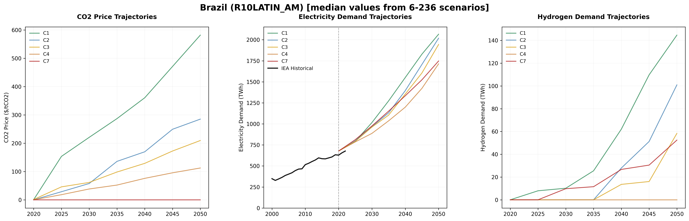

# VerveStacks Model Generation Notes - BRA
**Generated:** 2025-09-08 20:06:58

## Processing Parameters

### Individual Plant Tracking
| **Fuel Type** | **Threshold** | **Plants Above Threshold** | **Active Capacity** | **Mothballed Capacity** |
|---------------|---------------|----------------------------|--------------------|--------------------------|
| 🌱 **Bioenergy** | 50.0 MW | 136/152 plants | 18.1 GW | 0.2 GW |
| ⚫ **Coal** | 10.0 MW | 16/16 plants | 3.2 GW | — |
| 🔥 **Gas** | 10.0 MW | 99/99 plants | 26.5 GW | 0.1 GW |
| 💧 **Hydro** | 130.0 MW | 108/136 plants | 109.8 GW | — |
| ⚛️ **Nuclear** | — | 3/3 plants | 3.4 GW | — |
| 🛢️ **Oil** | 10.0 MW | 99/99 plants | 26.5 GW | 0.1 GW |
| ☀️ **Solar** | 200.0 MW | 15/19 plants | 39.6 GW | — |
| 💨 **Windon** | 200.0 MW | 24/29 plants | 37.1 GW | — |

### 🔄 CCS Retrofit Potential
| **Fuel Type** | **Retrofit Host Capacity** | **Retrofit Potential Capacity**
|---------------|----------------------------|-------------------------------|
| ⚫ **Coal** | 3.2 GW | 2.0 GW after capacity penalty |
| 🔥 **Gas** | 26.7 GW | 22.5 GW after capacity penalty |

## Data, Assumptions & Coverage

### Primary Data Sources

#### Base-Year Power Plant Specifications
- **Global Energy Monitor (GEM)** [🌐](https://globalenergymonitor.org)  
  Open-access database of individual power plants worldwide, including location, capacity, fuel type, commissioning year, and technical specifications.
- **International Renewable Energy Agency (IRENA)** [🌐](https://www.irena.org/Statistics)  
  Global renewable energy capacity and generation statistics (2000–2022), disaggregated by country and technology.
- **EMBER Climate** [🌐](https://ember-climate.org/data/)  
  Global dataset tracking electricity generation, installed capacity, and emissions intensity (2000–2022).

#### Enhanced Renewable Energy Characterization
- **GEM-REZoning-Atlite Integration** [`re_units_cf_grid_cell_mapping.csv`]  
  Enhanced renewable energy units with capacity factors from Atlite weather data and precise grid cell locations from REZoning database. This integration provides spatially-resolved capacity factors for existing renewable plants, enabling accurate performance modeling and grid cell assignment for spatial optimization.
- **Capacity Factor Enhancement**: Individual renewable plants receive location-specific capacity factors derived from 2013 hourly weather patterns
- **Spatial Grid Assignment**: Plants mapped to 50x50km REZoning grid cells for consistent spatial modeling

### Data Processing Notes
- **Individual Plant Coverage**: 95.3%% of total capacity from plant-level GEM data
- **Total Capacity Tracked**: 264.7 GW GW from all sources
- **Plants Above Threshold**: 352 individual plants tracked
- **Total Plants Processed**: 553 plants in database
- **Missing Capacity Added**: - **IRENA data**:
  - **hydro**: 1.67 GW
  - **solar**: 13.24 GW
- **EMBER data**:
  - **coal**: 0.08 GW
  - **bioenergy**: 4.01 GW

## Model Structure

### Files Included
- **Source Data**: `source_data/VerveStacks_BRA.xlsx` - the full dataset in a model-agnostic format
- **VEDA Model Files**: Complete model ready for Veda-TIMES execution
- **Scenario Files**: NGFS climate scenarios and policy assumptions

## AR6 Climate Scenarios - R10PAC_OECD

This model incorporates climate scenario drivers from the IPCC AR6 database for the **R10PAC_OECD** region, 
derived from 350 vetted scenario-model combinations spanning 5 climate categories 
from ambitious 1.5°C pathways (C1) to limited mitigation trajectories (C7). The scenarios cover 
7 years from 2020 to 2050, providing comprehensive 
pathways for energy system transformation under different climate policy futures.

### Climate Scenario Trajectories

  
  
<em>Climate scenario trajectories showing CO2 prices, electricity growth, and hydrogen deployment across different climate ambitions</em>

**Key Insights:**
- **5 Climate Categories**: From 1.5°C pathways to baseline scenarios
- **350 Scenario-Model Combinations**: Comprehensive coverage of transformation pathways  
- **Regional Context**: R10PAC_OECD region-specific climate policy patterns
- **Temporal Coverage**: 2020-2050 transformation trajectories

### Scenario-Model Divergence Analysis

**Model Agreement**: Analysis across 350 scenario-model combinations reveals:
- **High Convergence**: CO2 pricing trajectories (CV: inf%) and electricity growth (CV: 16.0%)
- **Moderate Uncertainty**: Transport electrification rates (CV: 62.8%) 
- **High Divergence**: Hydrogen deployment pathways (CV: inf%)

**Regional Characteristics**: The R10PAC_OECD region shows moderate convergence compared to global 
averages, with region-specific climate policy patterns reflecting economic and policy context.

## Quality Assurance

- Cross-validation between IRENA, EMBER, and UNSD statistics
- Capacity-generation consistency checks
- Technology classification verification
- Historical data reconciliation for base year (2022)
- Renewable resource potential validated against REZoning database
- Temporal analysis verified through statistical scenario methods

## Usage Notes

- This model is generated automatically using VerveStacks methodology
- Timeslice structure is optimized for high-renewable energy system analysis
- For questions about specific data sources or methodology, refer to online documentation
- Model parameters can be adjusted manually in the model files
- Charts and analysis files are located in `2_ts_design/outputs/BRA/`

---
*Generated by VerveStacks Energy Model Processor*
*For more information: [VerveStacks Documentation](https://github.com/your-org/vervestacks)*
